# 🏢 Web BIM Twin — 4D/5D IFC Digital Twin & Engineering Platform

[](https://www.typescriptlang.org/)
[](https://threejs.org/)
[](https://thatopen.com/)
[](https://vitejs.dev/)
[](https://opensource.org/licenses/MIT)

An enterprise-grade, high-performance Web BIM (Building Information Modeling) Viewer, 4D Construction Simulation engine, and 5D Cost Estimating Digital Twin suite. Built natively with **Vanilla TypeScript**, **`@thatopen/components` (Fragments API)**, and **Three.js**, with **zero heavy frontend framework overhead**.

---

## 📑 Table of Contents

1. [Architecture & System Design](#-architecture--system-design)
2. [Key Capabilities & Feature Matrix](#-key-capabilities--feature-matrix)
3. [Directory & Module Structure](#-directory--module-structure)
4. [Design System & 9 Architectural Themes](#-design-system--9-architectural-themes)
5. [Getting Started](#-getting-started)
6. [Keyboard Shortcuts & Command Palette](#-keyboard-shortcuts--command-palette)
7. [API & Module Reference](#-api--module-reference)
8. [Production Deployment](#-production-deployment)

---

## 🏗 Architecture & System Design

The application follows a clean, decoupled modular architecture with clear separation of concerns across core 3D systems, domain feature modules, tactical UI/HUD layers, and reactive theme controllers:

```mermaid
graph TD
    A[index.html / Entry Point] --> B[src/main.ts - Orchestrator]
    
    subgraph Core Engine [src/core/]
        B --> C[BimEngine - OpenBIM Singleton]
        B --> D[SceneManager - Sun / Shadows / Shaders]
        B --> E[ViewportController - Camera & Navigation]
        B --> F[ModelManager - WebAssembly Loader & IndexedDB]
        B --> G[ViewpointManager - Camera State Serializer]
        B --> H[KeyboardController - Global Shortcuts]
    end

    subgraph Feature Modules [src/modules/]
        B --> M1[Timeline4DModule & ScheduleManager - 4D Sequencing]
        B --> M2[Boq5DModule & BoqGenerator - 5D Estimating & CSV]
        B --> M3[AnnotationModule - 3D Pinned Notes & Tour]
        B --> M4[BcfManager - BCF 2.1/3.0 Topics & Viewpoints]
        B --> M5[IdsModule & IdsChecker - IDS Compliance Audits]
        B --> M6[ClippingModule - Real-Time Section Cuts]
        B --> M7[ExplosionModule - 3D Model Explosion]
        B --> M8[FederationModule - Multi-Model Federation]
        B --> M9[QueryModule - Spatial Tree & Isolation]
    end

    subgraph UI & HUD Layer [src/ui/]
        B --> U1[MinimapHUD - Tactical Polar Radar & Cone]
        B --> U2[CommandPalette - Ctrl+K Quick Action Runner]
        B --> U3[BimViewCube - 3D Orientation Gizmo]
        B --> U4[PropertyEditor - IFC Pset Inspector & Editor]
        B --> U5[CostChartComponent - 5D Budget & S-Curve]
        B --> U6[UIManager - Sidebar Tabs & Modals]
    end

    subgraph Theme Engine [src/theme/]
        B --> T1[ThemePalette - 9 Architectural Color Palettes]
    end
```



---

## 🌟 Key Capabilities & Feature Matrix

| Feature Domain | Capabilities |
| :--- | :--- |
| **🚀 3D Viewport & Rendering** | • High-speed WASM-backed IFC fragment parsing<br>• Local IndexedDB model caching for instant reloads<br>• Orbit, 2D Floor Plan, and First-Person Walkthrough (WASD) modes<br>• Real-time sun shadow simulation synchronized with time & solar azimuth<br>• Tactical Ground Reference Grid and ViewCube gizmo |
| **⏱️ 4D Construction Simulation** | • Automatic trade sequencing (`IFCSITE` $\rightarrow$ `IFCFOOTING` $\rightarrow$ `IFCSLAB` $\rightarrow$ `IFCWALL` $\rightarrow$ `IFCROOF` $\rightarrow$ `MEP`)<br>• Interactive timeline playback (`1x`, `2x`, `5x`, `10x`)<br>• Visual element states (Planned = Hidden, In Progress = Pulse, Completed = Solid)<br>• 4D schedule CSV export and template import |
| **💰 5D Cost Estimating & BOQ** | • Automatic `Qto_*` extraction (`NetVolume`, `NetArea`, `Length`, `Count`)<br>• Visual stacked Trade Budget distribution bar (Concrete, Steel, MEP, Finishes)<br>• Real-time S-Curve cashflow projections and category breakdown charts<br>• 1-Click Bills of Quantities export (`.csv`) |
| **📌 3D Pin Annotations & BCF** | • Surface raycasting pin drops with category badges (*Inspection, Defect, Safety, RFI, Sign-off*)<br>• Viewpoint snapshot serialization and element metadata tagging<br>• Guided multi-pin camera tour with smooth animations<br>• BCF 2.1 & 3.0 issue manager with `.bcfzip` export |
| **🛡️ IDS Compliance Audit** | • Automated validation against Information Delivery Specifications (`OBC.IDSSpecifications`)<br>• Pass/Fail breakdown for missing required property sets (`Qto_WallBaseQuantities`, etc.) |
| **🧭 Tactical Radar Minimap HUD** | • Polar radar grid with range rings ($r=20, 38, 56$), dashed crosshairs, and North indicator<br>• Rotating radar sweep ray with dynamic gradient illumination<br>• Real-time player camera orientation heading cone and elevation indicator (`ELV: +X.Xm`)<br>• 2D building footprint bounding box projection |
| **⚡ Command Palette & UX** | • `Ctrl+K` searchable fuzzy command launcher with 15+ instant actions<br>• Floating hierarchical viewport breadcrumbs with storey isolation<br>• Adaptive viewport cursors (Orbit, Pan, Crosshair, Scissors)<br>• Shift-Click multi-element selection with batch isolate / X-Ray |

---

## 📁 Directory & Module Structure

```
TOC/
├── index.html                     # Application UI shell & HUD containers
├── package.json                   # Dependencies & build scripts
├── tsconfig.json                  # TypeScript compiler configuration
├── vite.config.ts                 # Vite bundler & dev server config
├── README.md                      # Comprehensive project documentation
├── docs/                          # Developer & Engine Documentation
│   ├── ONBOARDING.md              # Detailed developer onboarding guide
│   └── that-open-engine-complete-verified.md # Offline That Open Engine documentation
└── src/
    ├── main.ts                    # Entry point & module bootstrapping
    ├── style.css                  # Dual-mode CSS tokens, 9 themes, Neo-Brutalist HUDs
    │
    ├── core/                      # Core 3D Engine Systems
    │   ├── BimEngine.ts           # Central OpenBIM singleton
    │   ├── SceneManager.ts        # Sun angle, shadows, post-processing
    │   ├── ViewportController.ts  # Camera transitions & projection modes
    │   ├── KeyboardController.ts  # Global shortcut listeners
    │   ├── ModelManager.ts        # IFC/frag loading & cache orchestration
    │   └── ViewpointManager.ts    # Camera state serialization & bookmarks
    │
    ├── modules/                   # Domain Feature Modules
    │   ├── AnnotationModule.ts    # 3D Pin annotations & guided tours
    │   ├── Timeline4DModule.ts    # 4D schedule simulation controller
    │   ├── ScheduleManager.ts     # 4D task scheduling data model
    │   ├── Boq5DModule.ts         # 5D quantity takeoff & CSV export
    │   ├── BoqGenerator.ts        # BOQ extraction engine & line-item aggregator
    │   ├── BcfManager.ts          # BCF 2.1/3.0 issue tracker & export
    │   ├── IdsModule.ts           # IDS compliance UI coordinator
    │   ├── IdsChecker.ts          # IDS schema validator engine
    │   ├── ClippingModule.ts      # Section planes & dynamic cutting
    │   ├── ExplosionModule.ts     # 3D model explosion along axes
    │   ├── FederationModule.ts    # Multi-model alignment & federation
    │   └── QueryModule.ts         # Spatial hierarchy filtering & isolation
    │
    ├── ui/                        # UI Components & HUD Overlays
    │   ├── CommandPalette.ts      # Ctrl+K quick action command runner
    │   ├── MinimapHUD.ts          # Tactical radar minimap & vision cone
    │   ├── BimViewCube.ts         # Interactive 3D orientation ViewCube
    │   ├── PropertyEditor.ts      # IFC Property Set inspector & editor
    │   ├── CostChartComponent.ts  # 5D budget chart & S-Curve visualizer
    │   └── UIManager.ts           # Sidebar tabs, drawers & modals
    │
    ├── theme/                     # Design Tokens & Theming
    │   └── ThemePalette.ts        # 9 theme definitions & 22 IFC category color maps
    │
    └── utils/                     # Utilities & Helpers
        ├── formatters.ts          # Currency, count, and date formatting
        └── storageCache.ts        # IndexedDB caching layer for models
```

---

## 🎨 Design System & 9 Architectural Themes

The application includes 9 bespoke architectural themes synchronized across Three.js materials, post-processing passes, and UI tokens (`currentColor` flat vector line icons):

1. **Zen Infrastructure** *(Default)*: Deep charcoal slate with Kintsugi Liquid Gold outlines (`#D4AF37`) and cyan accents.
2. **Pencil & Paper**: Crisp light architectural blueprint with graphite lines and cross-hatch sketch passes.
3. **Bluepen Draft**: Deep blueprint navy with cobalt drafting ink and structural coordinate grid.
4. **Cozy Warm**: Warm timber and clay hues with terracotta accents.
5. **Cyberpunk Neon**: High-contrast OLED dark with neon magenta outlines and CRT scanline shader pass.
6. **Retro Amber**: Industrial monochrome amber CRT terminal aesthetic.
7. **Matrix Emerald**: Phosphor matrix terminal green with digital grid background.
8. **Royal Indigo**: Deep space navy with high-tech indigo line art.
9. **Ice Light**: Ultra-clean clinical light mode with sky-blue highlights and high-contrast typography.

---

## 🚀 Getting Started

### Prerequisites
- [Node.js](https://nodejs.org/) (version 18.0 or higher)
- npm (Node Package Manager)

### Installation
```bash
git clone https://github.com/lalithebinezer/TOC.git
cd TOC
npm install
```

### Running Locally
```bash
npm run dev
```
Navigate to `http://localhost:3000/TOC/` or `http://localhost:5173/` in your browser.

### Building for Production
```bash
npm run build
```
Generates the optimized production bundle in the `dist/` directory.

---

## ⌨️ Keyboard Shortcuts & Command Palette

| Shortcut | Action | Description |
| :--- | :--- | :--- |
| **`Ctrl + K` / `Cmd + K`** | **Command Palette** | Open searchable fuzzy command runner |
| **`F`** | **Fit View** | Zoom to fit entire model in viewport |
| **`T`** | **Top View** | Switch to 2D Orthographic floor plan |
| **`I`** | **Isometric View** | Reset to 3D Isometric perspective |
| **`C`** | **Section Plane** | Create dynamic section cut at cursor |
| **`X`** | **Clear Sections** | Remove all active clipping planes |
| **`P`** | **Drop 3D Pin** | Toggle 3D annotation placement mode |
| **`Space`** | **4D Simulation** | Play / Pause 4D construction playback |
| **`Shift + Click`** | **Multi-Select** | Add / remove elements from batch selection |
| **`Escape`** | **Deselect / Close** | Clear active selection, close open modals |
| **`?`** | **Help & Guide** | Toggle interactive user guide modal |

---

## 📦 Tech Stack

- **3D & BIM Engine**: [`@thatopen/components`](https://github.com/ThatOpen/engine_components) & [`@thatopen/components-front`](https://github.com/ThatOpen/engine_components-front) (Fragments API)
- **Graphics Core**: [`Three.js`](https://threejs.org/) (WebGL2 with Postprocessing & Shadow Mapping)
- **Camera Controls**: [`camera-controls`](https://github.com/yomotsu/camera-controls)
- **Language**: TypeScript 5.x (Strict Type Safety)
- **Styling**: Vanilla CSS (CSS Custom Properties & Responsive Grid Architecture)
- **Build Tool**: [`Vite 6`](https://vitejs.dev/)

---

## 📄 License

This project is licensed under the MIT License — see the [LICENSE](LICENSE) file for details.
